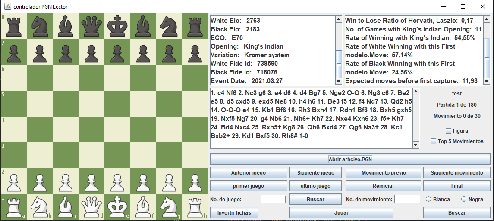

Lector de PGN para Ajedrez

Este proyecto es un lector de archivos PGN (Portable Game Notation) que permite visualizar y analizar partidas de ajedrez.
El programa ofrece varias funcionalidades de navegación, búsqueda y estadísticas de las partidas.

Características
Cargar archivos PGN: 

Permite abrir archivos PGN para ver las partidas almacenadas.

Visualización de Tablero: Muestra el tablero de ajedrez con piezas en sus posiciones actuales.

Estadísticas de la Partida:

Apertura y variación.

ID y fecha del evento.

Entre otros...

Navegación por Movimientos:

Siguiente y anterior movimiento.

Primero y último movimiento.

Reiniciar partida.

Navegación por Partidas:

Ir a la partida siguiente o anterior.

Primer y última partida.

Búsqueda de Partidas:

Búsqueda por número de partida.

Búsqueda por número de movimiento.

Cambio de Perspectiva del Tablero:

Invertir fichas (perspectiva del jugador blanco o negro).

Otras Opciones:

Selección de "Top 5 Movimientos" y "Figuras" para personalizar la visualización.

Modo de Uso

Cargar un Archivo PGN

Haz clic en el botón Abrir archivo .PGN para cargar un archivo de partidas de ajedrez en formato PGN.

Una vez cargado, podrás ver la información de la partida actual y los movimientos en el área de texto central.

Navegación de Partidas

Primer juego: Lleva a la primera partida del archivo PGN cargado.

Anterior juego: Retrocede a la partida anterior.

Siguiente juego: Avanza a la siguiente partida.

Último juego: Lleva a la última partida.

Navegación de Movimientos
Movimiento previo: Retrocede un movimiento en la partida actual.

Siguiente movimiento: Avanza un movimiento en la partida actual.

Reiniciar: Regresa al primer movimiento de la partida actual.

Final: Salta al último movimiento de la partida actual.

Búsqueda de Partidas y Movimientos

Buscar partida: Ingresa el número de partida en el campo No. de juego y haz clic en Buscar para ir directamente a esa partida.

Buscar movimiento: Ingresa el número de movimiento en el campo No. de movimiento y selecciona si quieres ver la perspectiva de Blanca o Negra para buscar un movimiento específico.

Cambiar Perspectiva del Tablero

Invertir fichas: Alterna la vista del tablero entre la perspectiva de las blancas y la de las negras.

Opciones de Visualización Adicionales

Figurine: Marca esta opción para ver las piezas representadas con figuras (en lugar de letras) en los movimientos.

Top 5 Movimientos: Muestra los cinco mejores movimientos de la partida según el análisis disponible en el archivo.

Información de la Partida

A la derecha del tablero, puedes ver detalles de la partida actual, incluyendo:

ELO de ambos jugadores.

Código de apertura (ECO) y variación de apertura.

ID de la partida y fecha del evento.

Estadísticas avanzadas, como la tasa de victorias para cada color con esta apertura.

Iniciar y Detener la Partida

Play: Inicia la reproducción automática de los movimientos de la partida actual.

Detener: Detiene la reproducción automática de movimientos.

